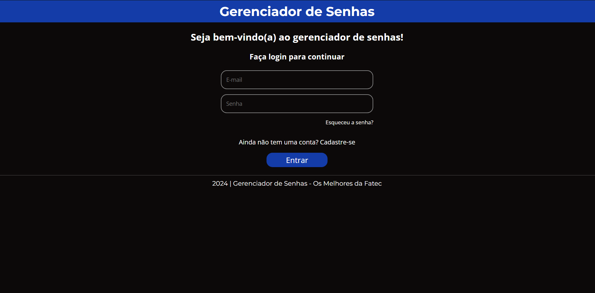
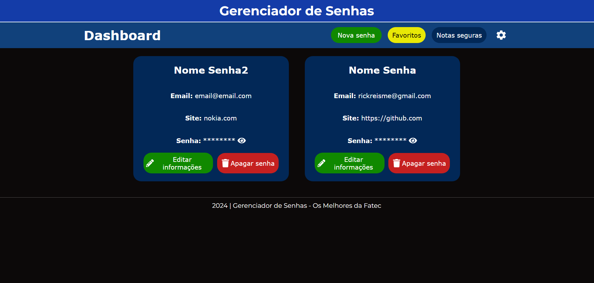
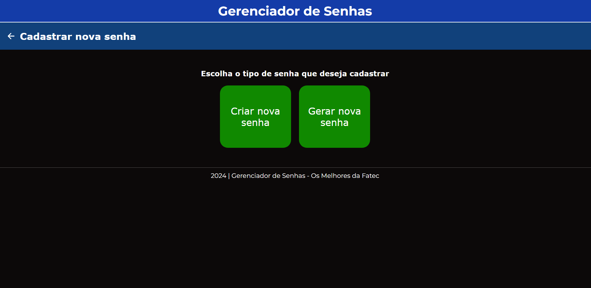
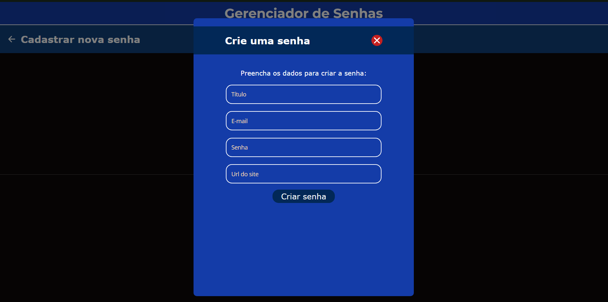
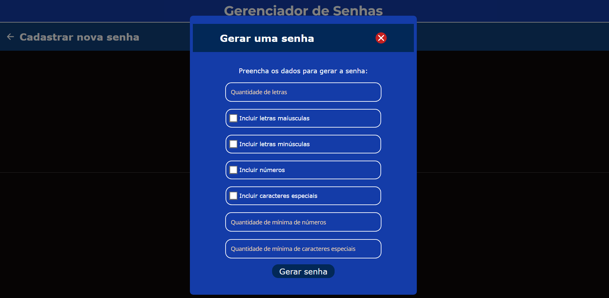
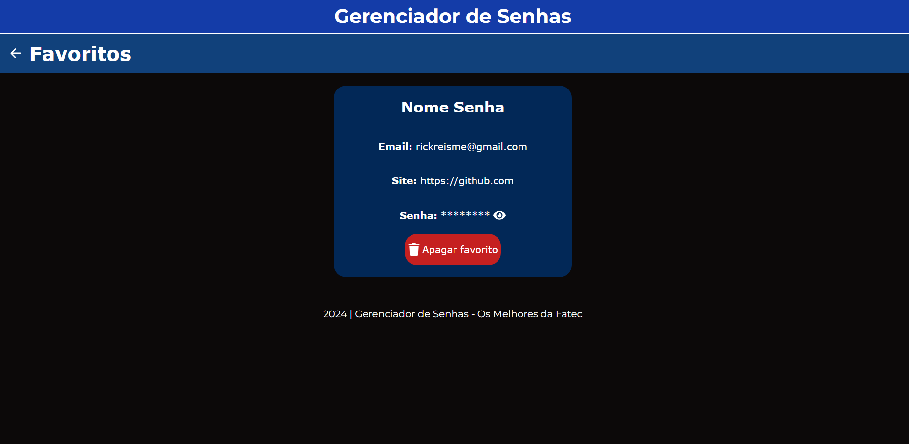
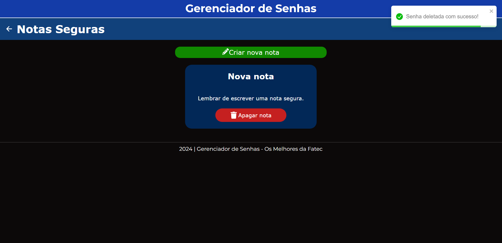

# Gerenciador de Senhas

## Sobre o Projeto

O Gerenciador de Senhas é uma solução desenvolvida para armazenar e gerenciar suas senhas de forma segura e eficiente. Com uma interface intuitiva.

Este projeto foi realizado em conjunto com os meus amigos como atividade final da disciplina de Tópicos Especiais em Python no 6º semestre do curso de Análise e Desenvolvimento de Sistemas da Faculdade de Tecnologia de Ribeirão Preto (Fatec).

**Observações:**
- Ao executar o projeto você será direcionado para a página de login, vá em 'Cadastre-se' para criar sua conta e em seguida faça login para acessar o Dashboard.
- A parte de redefinição de senha e as opções da página de configurações (exeto a opção 'Sobre') são somente visual, não apresentando nenhuma funcionalidade.
- Por enquanto o site só está otimizado para web, não está resposivo para dispositivos móveis.

## Capturas de tela








## Tecnologias Utilizadas

Nosso projeto utiliza tecnologias de ponta para garantir a melhor experiência e segurança:

- **Back-End:** Desenvolvido em Python, garantindo uma base sólida e segura.
- **Front-End:** Construído com Vite e React, proporcionando uma interface rápida e responsiva.
- **Outras tecnologias/ferramentas utilizadas:** Docker, SASS, Flask, PostgreSQL

## Nossa Equipe

- Camila Frazão
- João Henrique (responsável pelo banco de dados)
- Júlio Cesar (responsável pelo Back-End)
- Rickson Reis (responsável pelo Front-End)
- Vitor Hayaxibara

## Instruções para Rodar o Projeto
**Obs**: Tenha certeza que você tem o [Docker](https://www.docker.com) e o [Node.js ](https://nodejs.org/en)intalados em sua máquina.

### Back-End

1. Navegue até a pasta `Back_API_Python`.
2. Execute o arquivo `run.py`:
    ```bash
    python run.py
    ```

### Front-End

1. Navegue até a pasta `Front_Vite`.
2. Abra a pasta no terminal e execute o seguinte comando para baixar todas as dependências do projeto:
    ```bash
    npm install
    ```
3. Em seguida, execute o seguinte comando para iniciar a aplicação:
    ```bash
    npm run dev
    ```

### Banco de Dados

1. Navegue até a pasta `BD`.
2. Suba o container Docker executando o arquivo `docker-compose.yaml` com o seguinte comando:
    ```bash
    docker-compose up
    ```
**Obs**: caso queira alterar o nome de usuário, senha e nome do banco de dados padrões, mude os valores dos campos 'POSTGRES_USER', 'POSTGRES_PASSWORD' e 'POSTGRES_DB'.